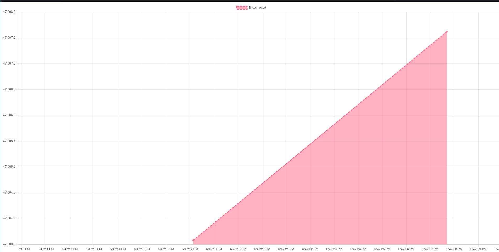

Live [demo](https://auipc.github.io/cloud-assignments/)

# Bitcoin data streaming using chart-js

- Use the chart-js library and the chartjs-plugin-streaming for realtime data streaming with charts.

- use the coindesk API to get the price of Bitcoin.

- Send a request to the API every 10 seconds and update the chart.

